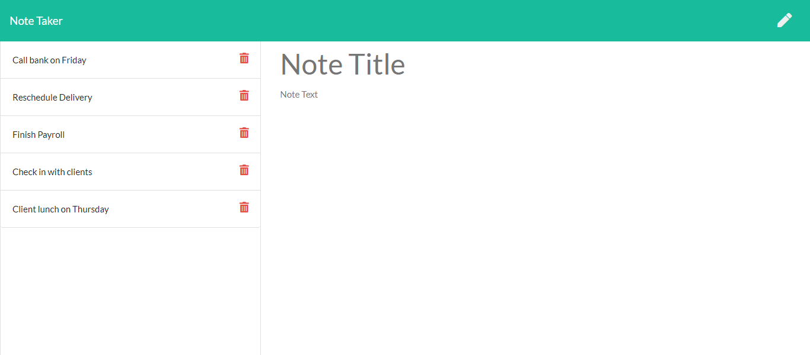

## Note-Taker

<h2> Table of Contents </h2>

- [Project Link](#project-link)
- [Description](#description)
- [What did we do](#what-did-we-do)
- [Getting Started](#getting-started)
- [Screenshots](#screenshots)

## Project Link

Click [here](https://safe-plateau-80884.herokuapp.com/) to view project on Heroku.
Click [here](https://pdubb3.github.io/note-taker/) to view deployed page.
Click [here](https://github.com/PDUBB3/note-taker.git) to view the Git repository.

## Description

In this project, I have created an application called Note taker, that can be used to write and save notes. This application uses an Express.js back end and will save and retrieve note data from a JSON file.

The Note Taker app allows the user to be able to write and save notes, so they can organize their thoughts and keep a track of tasks they need to complete.

I have used HTML, Javascript and CSS to create this weather dashboard to allow the user to search a city in the search bar, display the current days weather and also the weather for the next 5 days.

The cities the user searches is also saved within local storage and displayed on the search bar so the user can click onto their previously searched cities.

## What did we do?

In this application I have included the following elements:

- [x] When I open the note-taking application, then I am presented with a landing page with a link to a notes page.
- [x] When I click on the link to the notes pages, then I am presented with a page with existing notes listed in the left-hand column, plus empty fields to enter a new note title and the note's text in the right-hand column.
- [x] When I enter a new note's title and text, then a save icon appears in the navigation at the top of the page.
- [x] When I click on the save icon, then the new note I have entered and appears in the left-hand column with the other existing notes.
- [x] When I click on existing notes in the list in the left-hand column, then that note appears in the right-hand column.
- [x] When I click on the Write icon in the navigation at the top of the page, then I am presented with empty fields to enter a new note title and note's text in the right-hand column.

## Getting started

- Create a new GitHub repository called note-taker
- Clone github project onto your local machine
- Navigate into the project
- Open the project into VS code

```
git clone git@github.com:PDUBB3/note-taker.git
cd note-taker
code .
```

- Create `README.MD` file
- Create `src` folder
- Create `controller`, `routes` and `utils` folder inside the `src` folder
- Inside script within the `package.json` add the following scripts:

```
"dev": "nodemon src/index.js",
"start": "node src/index.js"
```

Installation

```
npm i

```

Run

```
npm run start

```

Dependencies

```
npm i express

npm i nodemon -D

npm i uuid

```

Run dependencies

```
npm i cors
npm run dev

```

### Screenshot of mock up


### Screenshot showing nNote taker app created

#### Notes created



#### Notes deleted


